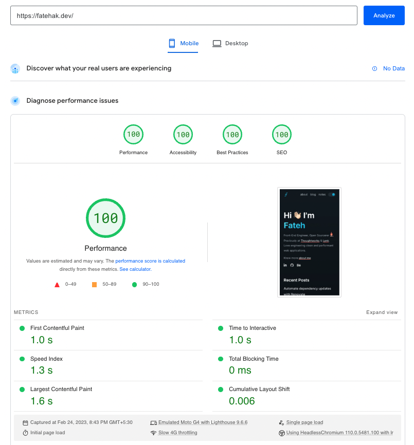
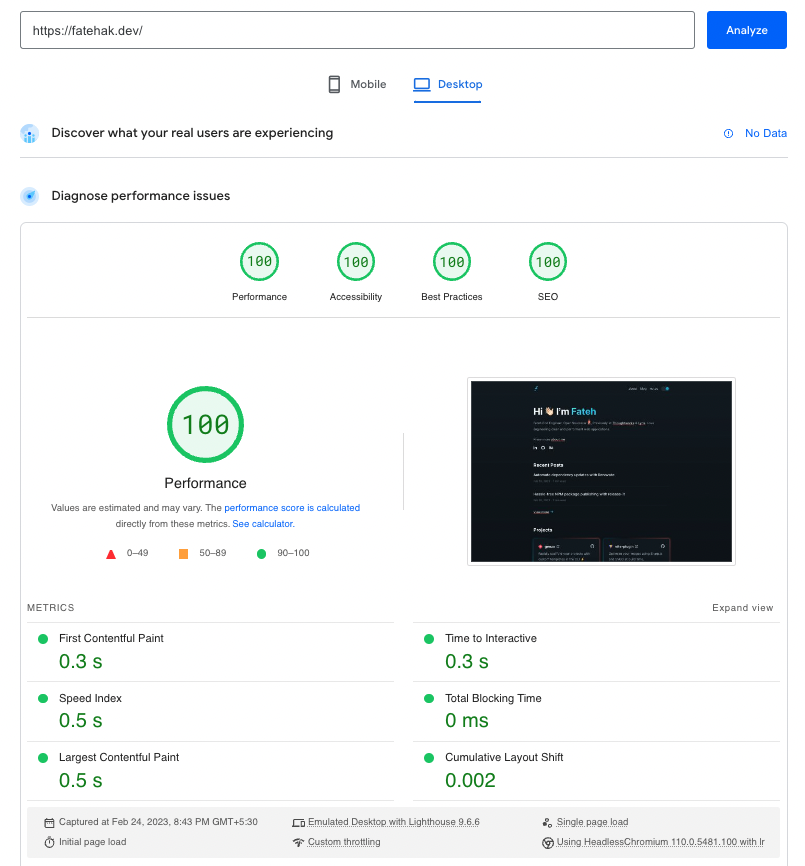

  
  <h1>fatehak.dev</h1>
  
  
  

&nbsp;

My personal website and blog built with [Astro](https://astro.build) and [MDX](https://mdxjs.com/).

I've always wanted a platform to showcase my projects and share my thoughts on the Web. This website started with the aim of fulfilling that dream. Hope you enjoy it! 😄

Take a look: [https://fatehak.dev](https://fatehak.dev)

## Uses

Technologies used to build the website:

- [Astro](https://astro.build/) and [MDX](https://mdxjs.com/)
- Web Components for interactivity.
- Tailwind CSS for theming.
- [Remark](https://github.com/remarkjs/remark) and [Rehype](https://github.com/rehypejs/rehype) plugins for markdown transforms.
- Prettier, Stylelint, Eslint for formatting.
- [Husky](https://typicode.github.io/husky/#/), [lint-staged](https://github.com/okonet/lint-staged), [commitlint](https://cz-git.qbb.sh/) for clean commits
- Github Actions for CI/CD.
- [Cloudflare](https://www.cloudflare.com) for publishing, DNS, and analytics.

## Metrics

I wanted to build the website with **speed** and **usability** in mind. So, I tried to use every trick to achieve maximum performance and ease of use.

Here is everything I've done so far:

- Kept JS payloads minimal with the '**no-framework**' strategy and used Web components for interactivity, this lead to a total payload size of just **6kB**!
- Prefetched on-page internal links at browser **idle** time.
- Prevented [CLS](https://web.dev/cls/) for images and video elements.
- Served images in **next-gen** formats with fallbacks.
- Optimal delivery of images based on **viewport size**.
- Self Hosted and preloaded critical fonts. Used [font subsetting](https://fonts.google.com/knowledge/glossary/subsetting) to further reduce file sizes from **700kB** to **90kB**!
- Removed [FOUC](https://en.wikipedia.org/wiki/Flash_of_unstyled_content) through proper asset loading.
- Set up Cloudflare with **Brotli** compression and configured headers for early **preload hints** and optimal cache TTL.
- Built accessible custom MDX components for a great reading experience.

## Lighthouse Test

I wanted to verify if all the optimizations I've done so far actually worked, so I did a Lighthouse test for my site [fatehak.dev](https://fatehak.dev).

To my surprise, I got an overall score of **100** consistently for both Mobile and Desktop on a five run average. It feels great when your hard work finally pays off! 🎉

Mobile Report:

Desktop Report:

## Links

Tools that came in handy for testing my website's performance:

- [PageSpeed Insights](https://pagespeed.web.dev/)
- [Webpage Test](https://www.webpagetest.org/)
- [Debug Bear](https://www.debugbear.com/test/website-speed)
- [Lighthouse Metrics](https://lighthouse-metrics.com/)
- [Yellow Lab](https://yellowlab.tools/)
